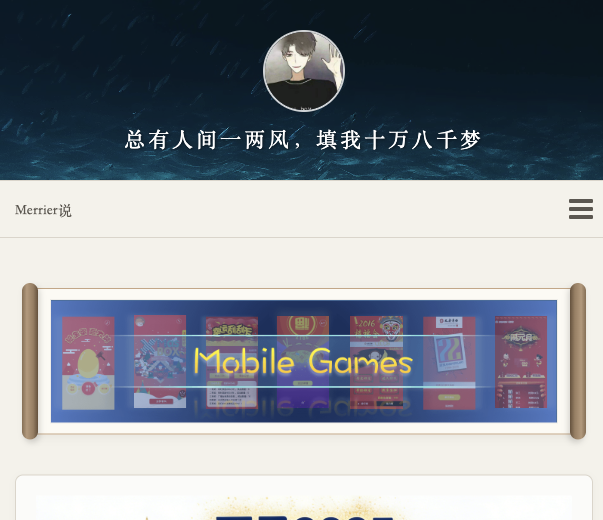
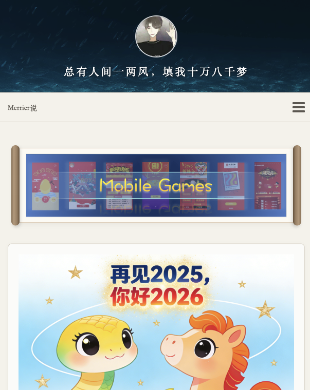
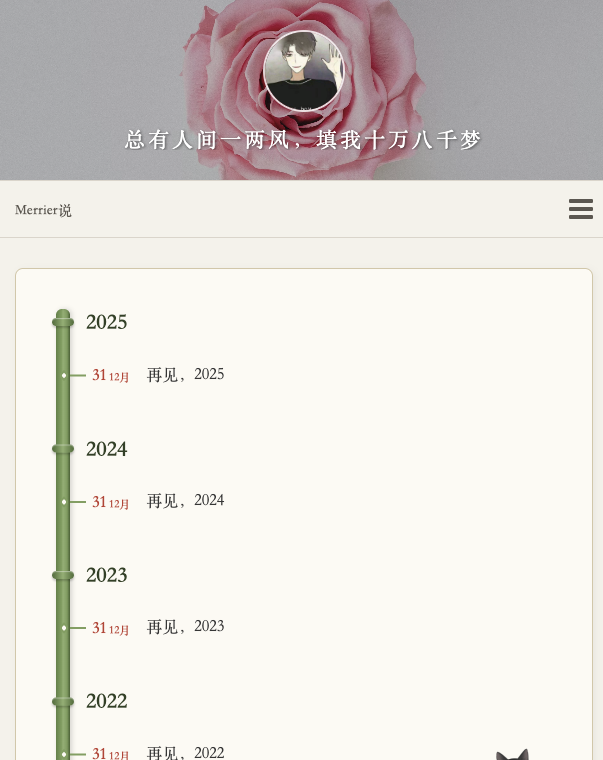

# Hexo Theme Qing (青)

> 一款以“中国风组件”为核心的 Hexo 主题：山水为幕，宣纸为底，竹简为轴，太极作动效。

**Qing (青)** 是一款为 Hexo 打造的响应式博客主题。它不是简单地给页面换一套古风配色，而是把中国传统视觉元素拆成可复用的博客组件：水墨头图、卷轴轮播、竹林归档、十二地支日期印章、国风日历、灯笼标签云、太极 Loading 与毛笔搜索。主题整体保留现代博客的阅读效率，同时给内容页、列表页和侧边栏都放入统一的东方审美线索。

## 组件预览







## 核心国风组件

- **山水首屏 Header**：首页顶部支持随机山水、花鸟、自然意象背景，也支持自定义图片或纯色背景；头像与宣传语叠在遮罩之上，保持可读性。
- **卷轴式推荐位**：首页 Carousel 被包装成横向卷轴，左右卷轴边、宣纸底和轻微投影让推荐内容更像一幅展开的画卷。
- **竹简文章元信息**：日期、分类、标签等信息使用宣纸色、朱砂红和竹简式排布；日期旁的十二地支印章会根据文章年份动态生成。
- **竹林时间轴归档**：归档页使用竹节主轴承载年份与文章节点，比传统列表更有“年轮”和“生长”的视觉感。
- **中国风日历 Widget**：侧边栏可接入 `hexo-he-calendar`，展示公历、农历、节气、黄历宜忌，并与主题配色协调。
- **灯笼 3D 标签云**：标签云使用 `TagCanvas` 呈现立体旋转效果，并以红金配色、竖排文字和上下灯笼结构强化节庆感。
- **Zhui 太极 Loading**：全局加载、图片懒加载均使用太极图形动效，避免普通 spinner 破坏主题气质。
- **毛笔搜索框**：本地搜索输入框吸收 Zhui 组件库的毛笔书写风格，让搜索也成为主题体验的一部分。

## 体验与工程特性

- **深浅色模式**：支持浅色、深色和跟随系统三种模式，状态保存于 `localStorage`。
- **中文阅读排版**：全局采用 `Noto Serif SC`、`Songti SC` 等衬线字体，文章图注自动从图片 `alt` 中生成。
- **响应式布局**：桌面端保留内容区与组件侧栏，移动端收敛为单栏，核心组件仍可读可用。
- **Nunjucks + Less + Gulp 4**：模板结构清晰，样式模块化，支持 Less 编译、资源压缩与部署前处理。

## 🚀 安装与使用

### 1. 下载主题

将本主题下载（或 Clone）到你的 Hexo 博客的 `themes` 目录下：

```bash
cd your-hexo-site
git clone https://github.com/your-username/hexo-theme-qing.git themes/qing
```

### 2. 启用主题

修改 Hexo 根目录下的 `_config.yml`，将 `theme` 字段设置为 `qing`：

```yaml
theme: qing
```

### 3. 安装依赖与构建

由于本主题使用了 Gulp 4 进行 Less 编译与资源压缩，你需要进入主题目录安装依赖并执行一次构建：

```bash
cd themes/qing
npm install
npx gulp default
```

### 4. 启动本地服务

回到 Hexo 根目录，启动服务即可预览效果：

```bash
cd ../../
hexo server
```

## 📋 全部配置预览 (`_config.yml`)

你可以通过修改主题目录下的 `_config.yml` 来开启或关闭相关功能。以下是主题支持的完整配置清单：

```yaml
# ---------------------------------------------------------------
#   Site Information And Theme Configuration Settings
#   language: zh-CN
# ---------------------------------------------------------------

## menu (顶部导航菜单)
menu:
- page: Home
  url: /
  icon: fa-home
- page: 前端
  url: /categories/frontend/
  icon: fa-tablet
# ...更多菜单配置请参考源码

## favicon (网站图标)
favicon: /favicon.ico
appleIcon: /images/hexo_others_10.png

## Feed (RSS 订阅)
rss: /atom.xml

## Carousel (右侧边栏幻灯片/推荐图片)
carousel:
  img: '/images/hexo_others_3.png'
  url: '//github.com/merrier/mobile-games'

# ==========================================
# 侧边栏小工具 (Widgets) 设置
# ==========================================
widgets:
  - search        # Zhui 风格全站搜索
  - he-calendar   # 中国风日历 (依赖 hexo-he-calendar 插件)
  - notification  # 网站公告
  - social        # 社交链接
  - category      # 分类列表
  - archive       # 归档列表
  - tagcloud      # 3D 标签云
  - friends       # 友情链接

## 搜索功能开关
jsonContent:
  searchLocal: true
  searchGoogle: false
  posts:
    title: true
    text: true
    content: true
    categories: false
    tags: false

## 中国风日历
he_calendar:
  route: 'he-calendar/' # 保持与 Hexo 根目录配置一致
  width: '100%'
  height: '130px'
  view: 'week'
  defaultTheme: 'red'
  hideHeader: true
  border_radius: '2px'

## 深色模式 (Dark Mode)
# 主题内置深色模式，无须配置，入口位于导航栏右侧，状态自动保存于浏览器 localStorage。

## 网站公告设置 (支持 HTML)
notification: |-
            <p>
                网站源码：<a href="https://github.com/merrier/merrier.github.io" target="_blank">merrier.github.io</a> <br/>
                代码集合：<a href="https://github.com/merrier/web-demo">Web Demo</a><br />
            </p>

## 社交链接设置
social:
 - name: Github
   icon: git
   href: //github.com/merrier
 - name: 邮箱
   icon: envelope-o
   href: mailto:953075999@qq.com

## 文章分类 & 归档面板设置
cate_config:
   show_count: true
   show_current: true

arch_config:
   type: 'monthly'
   format: 'YYYY年MM月'
   show_count: true
   order: -1

# 3D 标签云设置
tagcloud:
  tag3d: true
  textColour: '#444'
  outlineMethod: 'block'
  outlineColour: '#FFDAB9'
  interval: 30
  freezeActive: true
  frontSelect: true
  reverse: true
  wheelZoom: true

## 友情链接设置
links:
  - Harttle Land: https://harttle.land
  - 政子的博客: https://blog2.zhengzi.me/

# ==========================================
# 主题自定义个性化配置
# ==========================================

## 网站宣传语 (展示在左侧/顶部)
branding: 总有人间一两风，填我十万八千梦

## 设置首页头部背景 (国风主题特色配置)
## header_bg 支持三种模式:
##   - 'random': 随机中国风山水图片 (默认)
##   - 纯色/半透明代码: 例如 '#4a4a4a', 'rgb(74, 74, 74)', 或 'rgba(0, 0, 0, 0.5)'
##   - 图片路径: 例如 '/images/custom_bg.jpg' 或 'http://example.com/bg.png'
header_bg: 'random'

## 首页列表底部面板
homePanel: true

## 截取文章首页描述字数
excerptLength: 120

## 是否开启文章目录 (TOC)
toc: true

## 文章过期提醒功能
warning:
  days: 36500
  text: '本文于%d天之前发表，文中内容可能已经过时。'

## 文章内声明 (版权声明)
declaration:
  enable: true
  title: '转载声明'
  tip: |-
      商业转载请联系作者获得授权,非商业转载请注明出处 © <a href="//merrier.wang" target="_blank">Merrier说</a>

## 文章打赏 (微信/支付宝二维码)
reward:
  alipay: '/images/hexo_others_5.png'
  wepay: '/images/hexo_others_6.png'
  tip: 听说赞过就能年薪百万

# ==========================================
# 评论系统配置 (支持多种评论插件，选择一个开启)
# ==========================================
gitment:
  enable: false
livere:
  enable: false
uyan:
  enable: false
disqus:
  enable: true
  shortname: merrier
  count: true
changyan:
  enable: false
valine:
   enable: false
   appId: xOKV9J4UeQAtVkvnJC7Kq2Jn-gzGzoHsz
   appKey: erIpQac4azoCmgfBB7Dl9maa

# ==========================================
# 网站访客与分析统计
# ==========================================
## 网站访客统计 (文章阅读量与全站访问量)
visit_counter:
   site: true
   page: true

## 分析工具配置
cnzz_analytics: 1264342320
baidu_analytics:
google_analytics:
tencent_analytics:

## 百度站点认证与自动推送
baidu_site_verification:
baidu_push: true

# ==========================================
# 网站主题基础配置
# ==========================================
since: 2018
robot: 'all' ### 控制搜索引擎的抓取和索引编制行为
version: 1.0.2
```

## 🛠 开发与调试

如果你需要修改主题的 Less 样式或 JS 代码，可以使用主题内置的 Gulp 任务：

- 编译 Less 并压缩：`npx gulp less-task`
- 压缩 JS：`npx gulp minify-js`
- 压缩 HTML 模板（注意已过滤 `canvas` 内部数据源）：`npx gulp minify-html`
- 一键执行全部：`npx gulp default`

## 📝 鸣谢

- 感谢 [Hexo](https://hexo.io/) 提供的强大博客框架。
- 感谢 [Zhui 组件库](https://merrier.wang/zhui/) 提供的国风 UI 交互灵感。
- 感谢 [LoremFlickr](https://loremflickr.com/) 提供的随机图片占位服务。
- 感谢 [故宫博物院](https://www.dpm.org.cn/) 官网提供的标题云纹等传统设计灵感。

---
*“一蓑烟雨任平生，也无风雨也无晴。”* 
愿 **Qing** 能为你带来宁静的写作时光。
